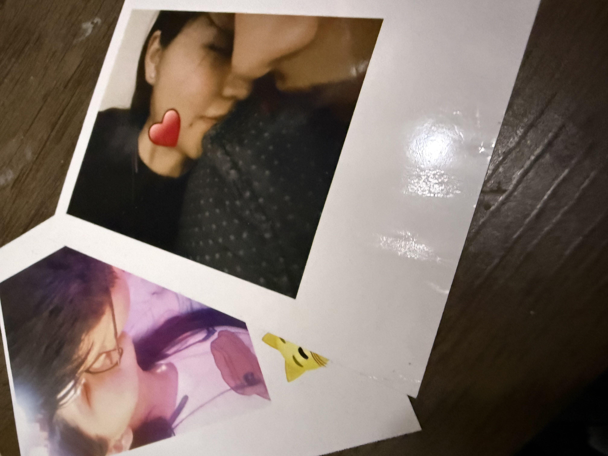

<html lang="es">
<head>
<meta charset="UTF-8">
<meta name="viewport" content="width=device-width, initial-scale=1.0">
<title>¿Quieres ser mi San Valentín? 💘</title>

</head>

<body>

    

    <h1>¿Quieres ser mi San Valentín, Croqueta? U3U</h1>
    

    
Tendrás un día llena de tu música favorita y rica comida chiqui 🥰

    

        
🎶 I.L.Y. - The Rose

        <button id="playPause">▶️</button>
        <input type="range" id="progress" value="0" min="0" max="100">
    

    

        <button id="yes">Sí 🥰</button>
        <button id="no">No 🧐💀</button>
    

    

<audio id="music">
    <source src="music.mp3" type="audio/mpeg">
</audio>

</body>
</html>
